# 支付模块

> 记录银联、网商接口调用和流程梳理

## 一、支付流程

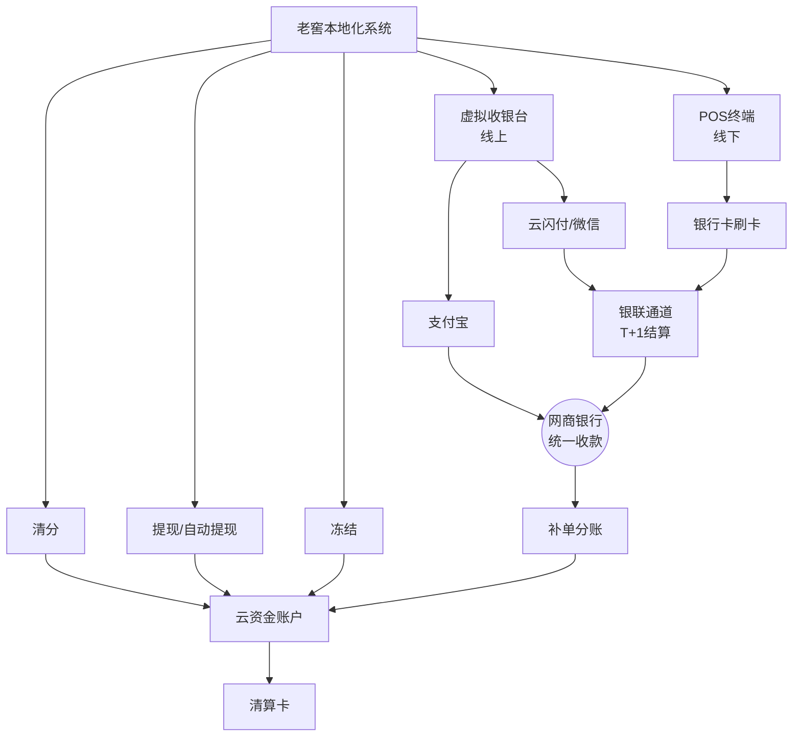

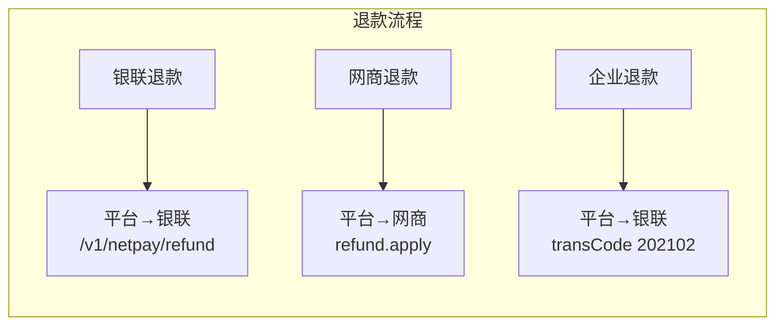

> **注意**：PC端生成的二维码已指定收款通道，如果支付方式不匹配（如支付宝扫微信支付码），会拒绝支付。

## 二、核心业务流程

### 2.1 商户入驻

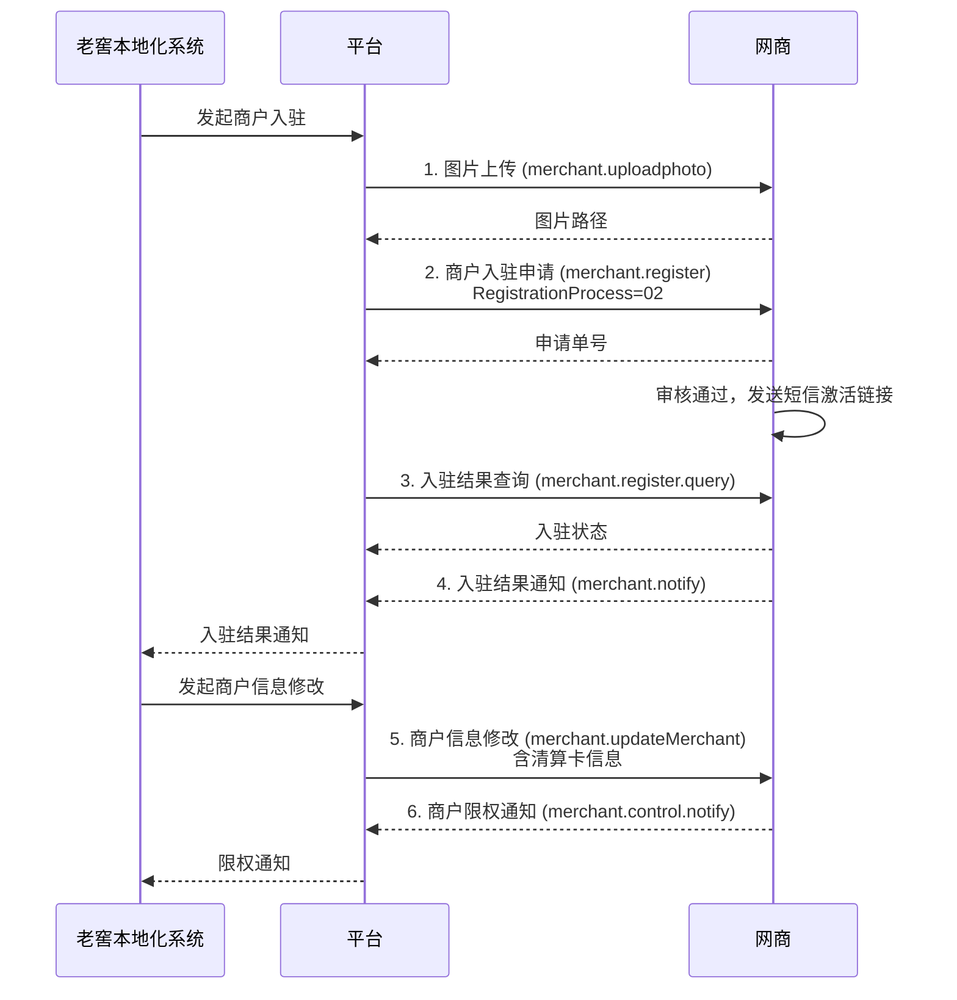

### 2.2 支付流程

**场景A：银联收款（微信/云闪付）**

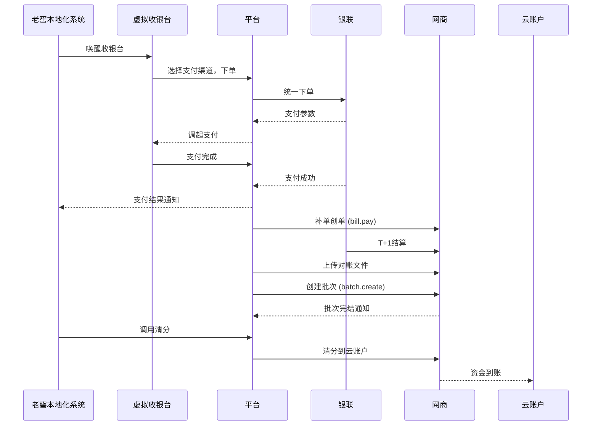

**场景B：POS终端收款（银行卡刷卡）**

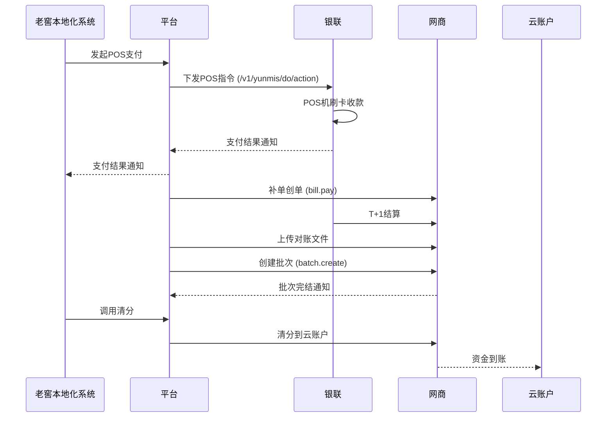

**场景C：网商收银台收款（支付宝）**

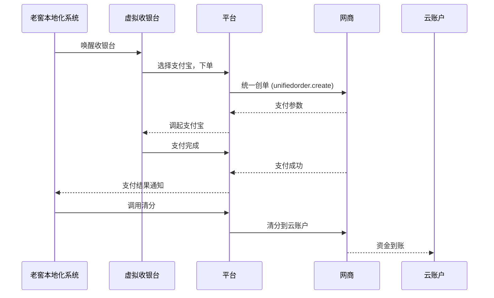

### 2.3 退款流程

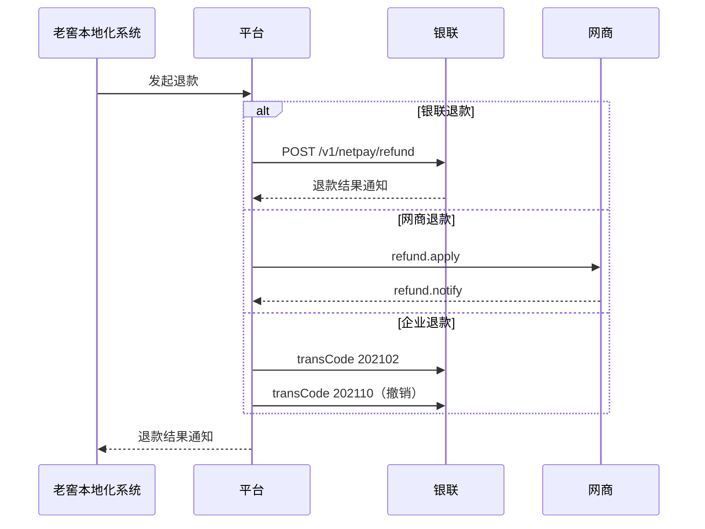

### 2.4 提现流程

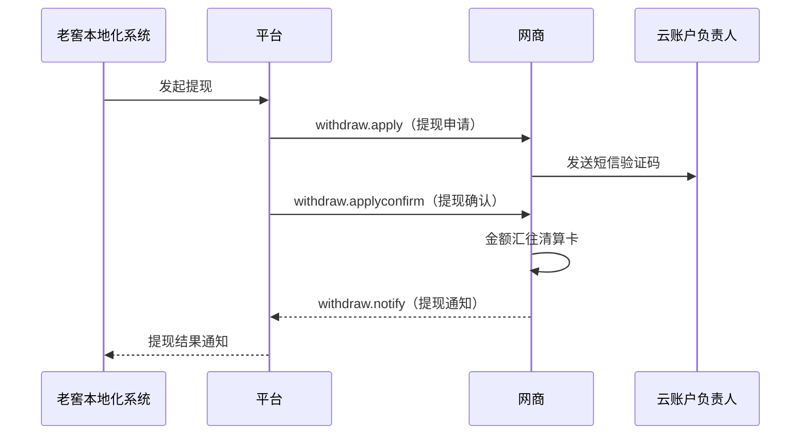

### 2.5 清分流程

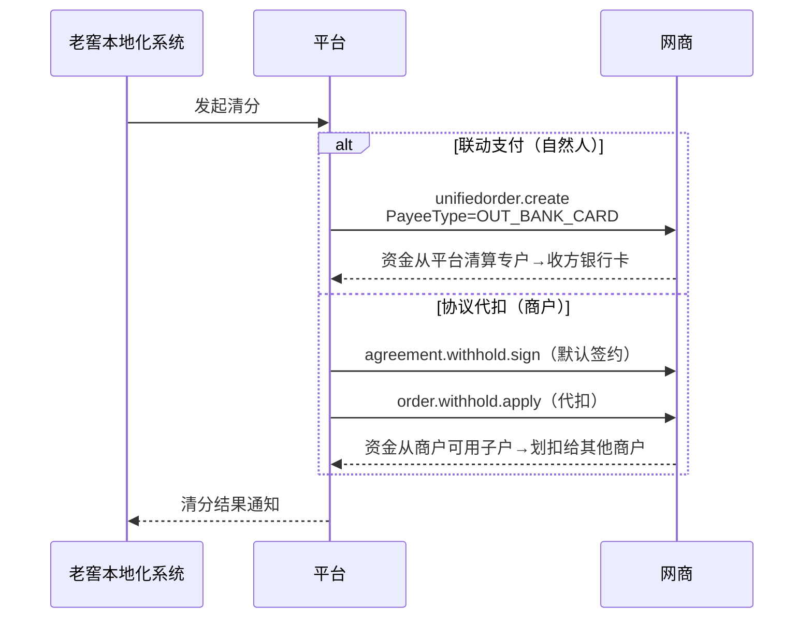

### 2.6 冻结/解冻

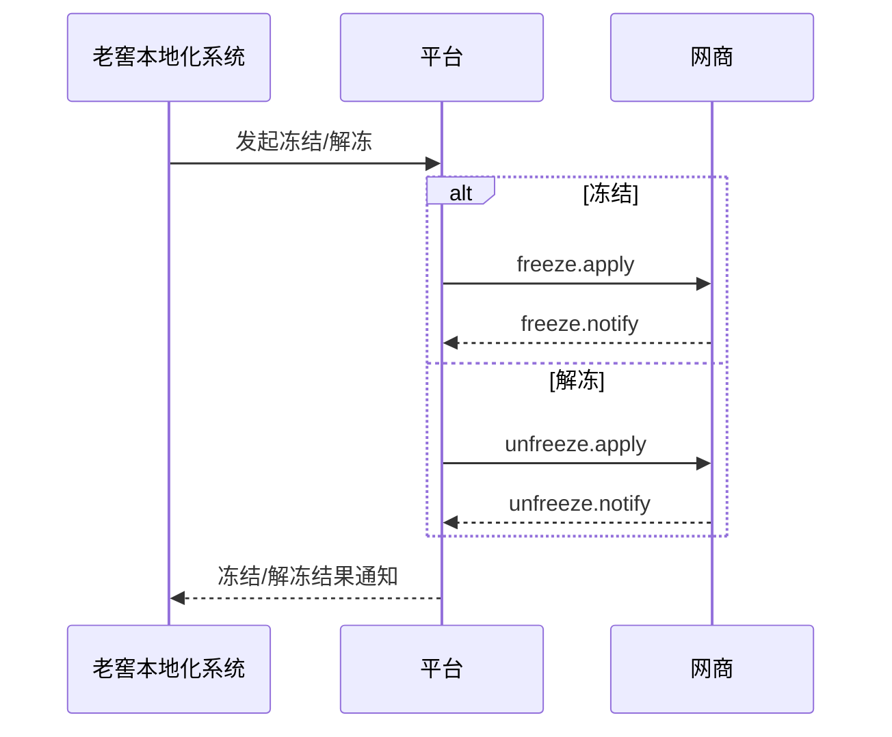

### 2.7 对账

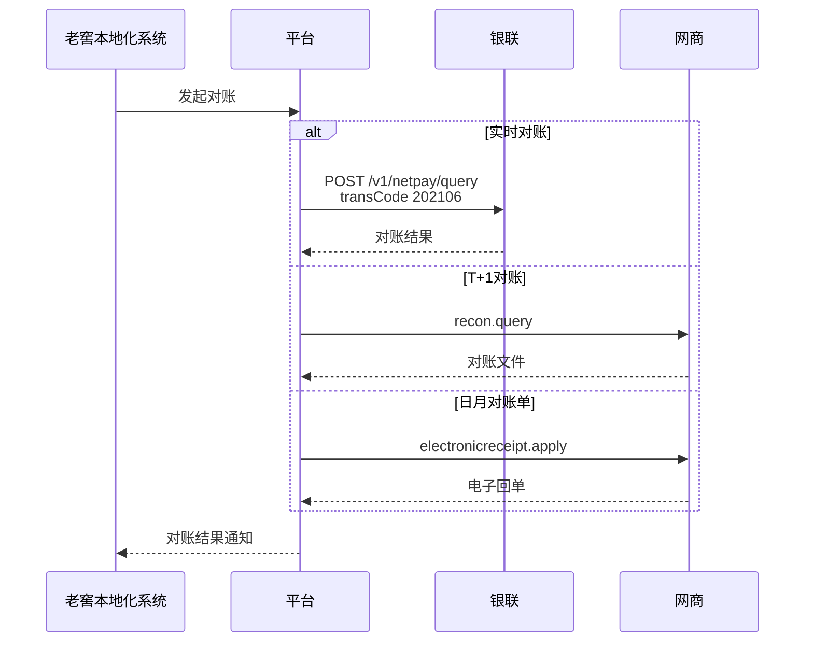

## 三、支付通道路由

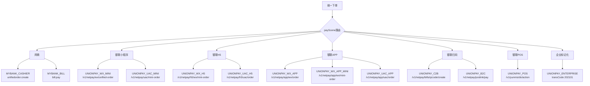

> 套码策略：先用低费率mid → 失败自动fallback高费率mid

## 四、接口清单

### 4.1 商户入驻（网商）

| 接口 | Function | 方向 |
|------|----------|------|
| 图片上传 | ant.mybank.merchantprod.merchant.uploadphoto | →网商 |
| 入驻申请 | ant.mybank.merchantprod.merch.register | →网商 |
| 结果查询 | ant.mybank.merchantprod.merch.register.query | →网商 |
| 结果通知 | ant.mybank.merchantprod.merch.notify | ←网商 |
| 重发短信 | ant.mybank.bkmerchantprod.merch.applet.activityurl.send | →网商 |
| 商户信息查询 | ant.mybank.merchantprod.merch.query | →网商 |
| 信息修改 | ant.mybank.merchantprod.merch.updateMerchant | →网商 |
| 限权通知 | ant.mybank.merchantprod.merch.control.notify | ←网商 |
| 授权状态查询 | ant.mybank.merchantprod.merchant.arrangement.info.query | →网商 |
| 授权/解约通知 | ant.mybank.merchantprod.merchant.arrangement.info.notify | ←网商 |
| 解约申请审核 | ant.mybank.merchantprod.merchant.arrangement.audit | →网商 |

### 4.2 支付（银联）

| 接口 | URL | 方向 |
|------|-----|------|
| 微信小程序 | /v1/netpay/wx/unified-order | →银联 |
| 云闪付小程序 | /v1/netpay/uac/mini-order | →银联 |
| 微信H5 | /v1/netpay/h5/wx/mini-order | →银联 |
| 云闪付H5 | /v1/netpay/h5/uac/order | →银联 |
| 微信APP | /v1/netpay/app/wx/order | →银联 |
| 微信跳转小程序 | /v1/netpay/app/wx/mini-order | →银联 |
| 云闪付APP | /v1/netpay/app/uac/order | →银联 |
| C扫B主扫 | /v1/netpay/bills/qrcode/create | →银联 |
| B扫C被扫 | /v1/netpay/poslink/pay | →银联 |
| POS终端 | /v1/yunmis/do/action | →银联 |
| 企业订单生成 | transCode 202101 | →银联 |
| 支付查询 | /v1/netpay/query | →银联 |
| 企业订单查询 | transCode 202106 | →银联 |
| 订单关闭 | /v1/netpay/close | →银联 |
| 支付结果通知 | 回调notifyUrl | ←银联 |

### 4.3 支付（网商）

| 接口 | Function | 方向 |
|------|----------|------|
| 收银台创单 | ant.mybank.bkcloudfunds.unifiedorder.create | →网商 |
| 收银台查询 | ant.mybank.bkcloudfunds.unifiedorder.query | →网商 |
| 收银台通知 | ant.mybank.bkcloudfunds.unifiedorder.notify | ←网商 |
| 吱口令创建 | ant.mybank.bkcloudfunds.unifiedorder.sharetoken.create | →网商 |
| 补单创单 | ant.mybank.bkcloudfunds.bill.pay | →网商 |
| 补单作废 | ant.mybank.bkcloudfunds.bill.cancel | →网商 |
| 来账通知 | ant.mybank.bkcloudfunds.vostro.notify | ←网商 |
| 来账明细查询 | ant.mybank.bkcloudfunds.vostro.batchquery | →网商 |
| 渠道结算入账通知 | ant.mybank.bkcloudfunds.channel.vostro.notify | ←网商 |

### 4.4 退款（银联）

| 接口 | URL/transCode | 方向 |
|------|---------------|------|
| 网络退款 | /v1/netpay/refund | →银联 |
| 退款查询 | /v1/netpay/refund-query | →银联 |
| 企业退款 | transCode 202102 | →银联 |
| 退款撤销 | transCode 202110 | →银联 |
| 退货查询 | transCode 202109 | →银联 |
| 退款通知 | 回调notifyUrl | ←银联 |

### 4.5 退款（网商）

| 接口 | Function | 方向 |
|------|----------|------|
| 退款申请 | ant.mybank.bkcloudfunds.refund.apply | →网商 |
| 退款通知 | ant.mybank.bkcloudfunds.refund.notify | ←网商 |
| 退款查询 | ant.mybank.bkcloudfunds.refund.query | →网商 |
| 代扣退款 | ant.mybank.bkcloudfunds.protocol.withhold.refund.apply | →网商 |
| 代扣退款通知 | ant.mybank.bkcloudfunds.protocol.withhold.refund.result.notify | ←网商 |
| 代扣退款查询 | ant.mybank.bkcloudfunds.protocol.withhold.refund.query | →网商 |

### 4.6 提现（网商）

| 接口 | Function | 方向 |
|------|----------|------|
| 提现申请 | ant.mybank.bkcloudfunds.withdraw.apply | →网商 |
| 提现确认 | ant.mybank.bkcloudfunds.withdraw.applyconfirm | →网商 |
| 提现通知 | ant.mybank.bkcloudfunds.withdraw.notify | ←网商 |

### 4.7 清分（网商）

| 接口 | Function | 方向 |
|------|----------|------|
| 联动支付 | ant.mybank.bkcloudfunds.unifiedorder.create | →网商 |
| 签约申请 | ant.mybank.bkcloudfunds.agreement.withhold.sign | →网商 |
| 签约查询 | ant.mybank.bkcloudfunds.agreement.withhold.query | →网商 |
| 代扣申请 | ant.mybank.bkcloudfunds.order.withhold.apply | →网商 |
| 代扣通知 | ant.mybank.bkcloudfunds.protocol.withhold.result.notify | ←网商 |
| 代扣查询 | ant.mybank.bkcloudfunds.protocol.withhold.query | →网商 |
| 保证金扣除通知 | ant.mybank.bkcloudfunds.billpay.platform.deposit.notify | ←网商 |
| 退保申请 | ant.mybank.bkcloudbatch.stmt.deposit.return | →网商 |
| 退保查询 | ant.mybank.bkcloudbatch.stmt.deposit.return.query | →网商 |

### 4.8 冻结/解冻（网商）

| 接口 | Function | 方向 |
|------|----------|------|
| 冻结申请 | ant.mybank.bkcloudfunds.merchant.account.freeze.apply | →网商 |
| 解冻申请 | ant.mybank.bkcloudfunds.merchant.account.unfreeze.apply | →网商 |
| 解冻通知 | ant.mybank.bkcloudfunds.merchant.account.unfreeze.notify | ←网商 |
| 解冻查询 | ant.mybank.bkcloudfunds.merchant.balance.unfreeze.query | →网商 |

### 4.9 余额查询

| 接口 | Function/transCode | 方向 |
|------|-------------------|------|
| 网商余额 | ant.mybank.bkcloudfunds.balance.query | →网商 |
| 网商场景余额 | ant.mybank.bkcloudfunds.merchant.scene.balance.query | →网商 |
| 银联企业余额 | transCode 202108 | →银联 |

### 4.10 对账

| 接口 | Function | 方向 |
|------|----------|------|
| 网商对账文件 | ant.mybank.bkcloudfunds.recon.query | →网商 |
| 银联对账文件 | SFTP推送 | ←银联 |
| 银联操作记录 | transCode 202107 | →银联 |

### 4.11 电子回单（网商）

| 接口 | Function | 方向 |
|------|----------|------|
| 申请回单 | ant.mybank.bkcloudfunds.electronicreceipt.apply | →网商 |
| 批量申请 | ant.mybank.bkcloudfunds.electronicreceipt.batchapply | →网商 |
| 查询结果 | ant.mybank.bkcloudfunds.electronicreceipt.query | →网商 |
| 回单通知 | ant.mybank.bkcloudfunds.electronicreceipt.notify | ←网商 |

### 4.12 批次管理（网商）

| 接口 | Function | 方向 |
|------|----------|------|
| 创建批次 | ant.mybank.bkcloudbatch.batch.create | →网商 |
| 批次查询 | ant.mybank.bkcloudbatch.batch.query | →网商 |
| 批次完结通知 | ant.mybank.bkcloudfunds.billpay.batch.finish.notify | ←网商 |

### 4.13 POS终端（银联）

| 接口 | URL | 方向 |
|------|-----|------|
| 设备绑定 | /v1/yunmis/device/bang | →银联 |
| 指令下发 | /v1/yunmis/do/action | →银联 |
| 查询结果 | /v1/yunmis/pay/query | →银联 |
| 批量查询 | /v1/yunmis/pay/query-batch | →银联 |
| 回调通知 | urlNotify | ←银联 |

### 4.14 企业标记化（银联）

| 接口 | transCode | 方向 |
|------|-----------|------|
| 企业订单生成 | 202101 | →银联 |
| 企业订单退款 | 202102 | →银联 |
| 企业订单关闭 | 202103 | →银联 |
| 企业订单划付 | 202104 | →银联 |
| 企业订单分账 | 202105 | →银联 |
| 企业订单查询 | 202106 | →银联 |
| 操作记录查询 | 202107 | →银联 |
| 商户余额查询 | 202108 | →银联 |
| 退货订单查询 | 202109 | →银联 |
| 退款撤销 | 202110 | →银联 |
| 异步通知 | 回调notifyUrl | ←银联 |
